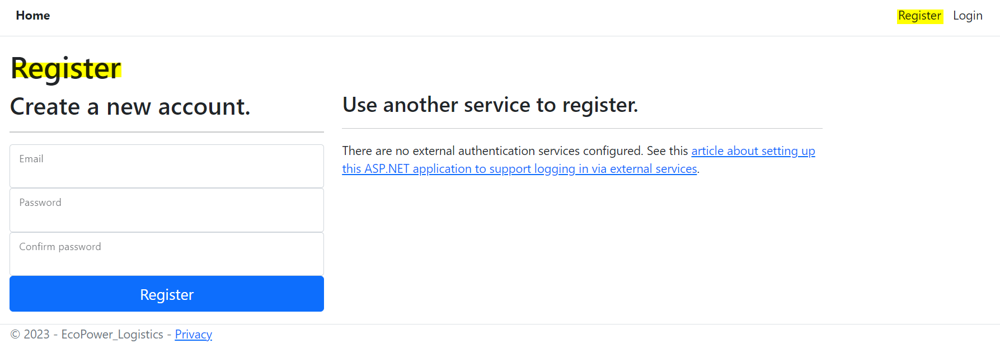
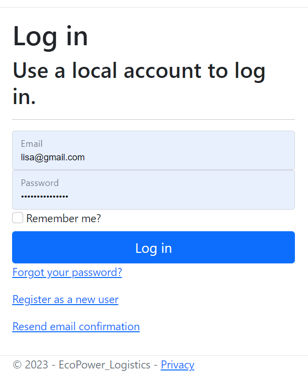
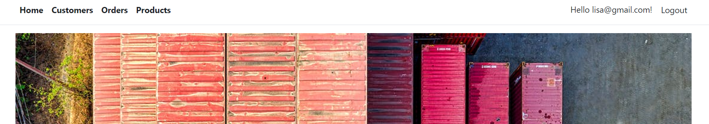
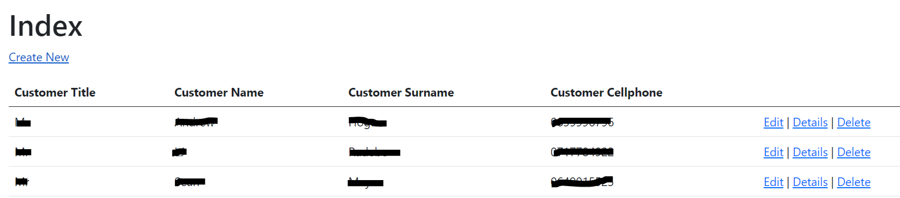
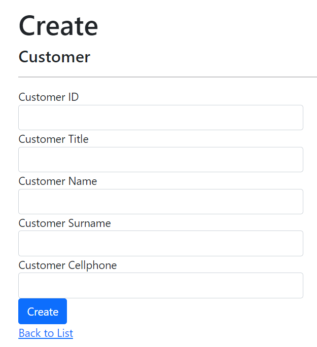
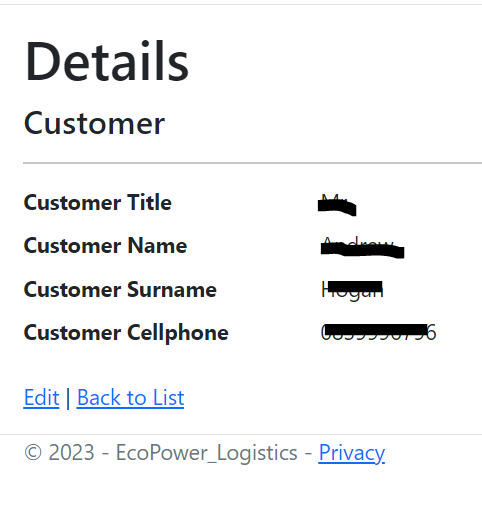
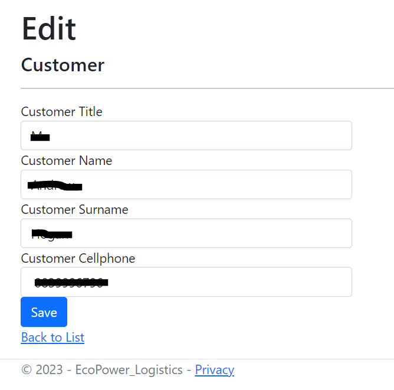
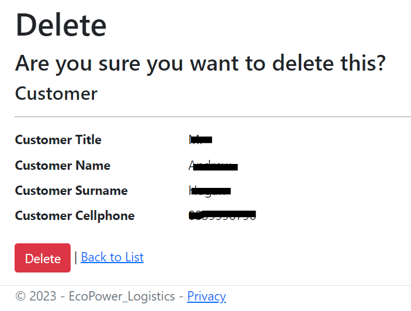

# CMPG323-Project3-33509735
Link to APP on Azure: https://ecopowerlogistics20230918122617.azurewebsites.net/

## Overview
In this day and age, there are millions of applications that have been created and are widely used. A developer’s ability to read and understand code is even more important than their ability to write code. As such, you will be given an existing ASP.NET Core MVC Web Application that will need to be enhanced and improved. 
As part of this project, you will be expected to understand architectural patterns as well as pay specific attention to implementing coding principles and design patterns

## How to use APP
The APP is hosted on AZURE web portal. The following steps will give a guide on how to use the APP hosted in AZURE web portal:
1. Go to: https://ecopowerlogistics20230918122617.azurewebsites.net/
2. Register an account with username and password (Your password must contain 8 or more character, full capital and small capital letters, symbols and numbers for example "aBdDcC12!@").

3. Login to your account using your created credentials.

4. You will be given a authorization when you see the home screen.

5. All table (Customer, Order, Product) have the same methods (Index, Create, Details, Edit, Delete).

## How to use Methods
After obtaining authorization, the interface is very standard format, with each method having a clear description of what will be achieved: 
### View
View all the data of the current selected table (Customer, Product, Order). The other methods will be displayed when database and webpage is loaded successfully ("Create"-top left of screen, "Edit", "Details", "Delete"- Right of screen).

### Create
Create a new data element in the selected table for example in the Product table if you click new you can create a new Product (Shampoo, Google Glasses) inside the Product table.

### Details
View the single row selected in more relevant detail.

### Edit
Edit any data element that is currently in the list. If you accidentally mispelled the data element you can easily edit and fix it.

### Delete
If at some point data is incorrect, duplicated or irrelevant you can easily just delete the data element in the current table.

## Refrences
1. Pro Code Guide. 2021. Entity Framework Core in ASP.NET Core 3.1 – Getting Started. https://procodeguide.com/programming/entity-framework-core-in-asp-net-core/ Date of access: 30 Aug. 2023.
2. Microsoft. 2023. .NET Hot Reload support for ASP.NET Core https://learn.microsoft.com/en-us/aspnet/core/test/hot-reload?view=aspnetcore-6.0 Date of access: 30 Aug. 2023.
3. Microsoft. 2023. ASP.NET Core Best Practices https://learn.microsoft.com/en-us/aspnet/core/fundamentals/best-practices?view=aspnetcore-6.0 Date of access: 30 Aug. 2023.
4. Microsoft. 2023. Build web apps with ASP.NET Core for beginners. https://learn.microsoft.com/en-us/training/paths/aspnet-core-web-app/ Date of access: 18 Sept. 2023.
5. Microsoft. 2023. ASP.NET MVC Overview. https://learn.microsoft.com/en-us/aspnet/mvc/overview/older-versions-1/overview/asp-net-mvc-overview Date of access: 14 Sept. 2023.
6. Microsoft. 2023. Secure a .NET web app with the ASP.NET Core Identity framework. https://learn.microsoft.com/en-us/training/modules/secure-aspnet-core-identity/ Date of access: 18 Sept. 2023.
7. C# Corner. 2023. Design Patterns In C# .NET (2023). https://www.c-sharpcorner.com/UploadFile/bd5be5/design-patterns-in-net/ Date of access: 15 Sept. 2023.
8. Microsoft. 2023. Use an App Service Environment. https://learn.microsoft.com/en-us/azure/app-service/environment/using Date of access: 15 Sept. 2023.
9. Microsoft. 2023. Dependency injection in ASP.NET Core. https://learn.microsoft.com/en-us/aspnet/core/fundamentals/dependency-injection?view=aspnetcore-7.0 Date of access: 18 Sept. 2023.
10. C# Corner. 2012. Architectural Patterns in .NET. https://www.c-sharpcorner.com/uploadfile/babu_2082/architectural-patterns-in-net/ Date of access: 16 Sept. 2023.
11. Microsoft. 2022. Implementing the Repository and Unit of Work Patterns in an ASP.NET MVC Application (9 of 10). https://learn.microsoft.com/en-us/aspnet/mvc/overview/older-versions/getting-started-with-ef-5-using-mvc-4/implementing-the-repository-and-unit-of-work-patterns-in-an-asp-net-mvc-application Date of access: 16 Sept. 2023.
12. Microsoft. 2014. C# Best Practices: Dangers of Violating SOLID Principles in C#. https://learn.microsoft.com/en-us/archive/msdn-magazine/2014/may/csharp-best-practices-dangers-of-violating-solid-principles-in-csharp Date of access: 18 Sept. 2023.
13. Microsoft. 2023. Cloud Design Patterns. https://learn.microsoft.com/en-us/azure/architecture/patterns/ Date of access: 18 Sept. 2023.
14. Microsoft. 2009. Patterns and Practices – You Can Depend On Patterns and Practices. https://learn.microsoft.com/en-us/archive/msdn-magazine/2009/may/patterns-and-practices-simplifying-patterns-and-practices Date of access: 15 Sept. 2023.
15. Microsoft. 2022. Best practices in cloud applications. https://learn.microsoft.com/en-us/azure/architecture/best-practices/index-best-practices Date of access: 15 Sept. 2023.

